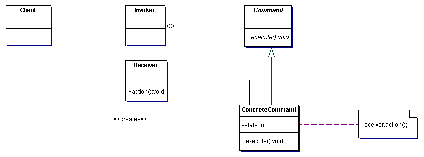

# Command

The Command pattern is used to encapsulate and package up all the necessary information to invoke a method or request. This makes it easier to queue, log, or undo operations. In a lot of ways it can be though of like a transaction or an object oriented replacement for callbacks.

## Example

Imagine we are writing a rich text editor. We know that we have to support features like bold, italics, headings, etc. Initially we might think that we can wright a single class to peform such operations (bold method, italic method). When a user clicks the appropriate button we simply call that method. However we also need to support undo operations so now we have to maintain that history of operations. Next if we want to add new functionality later we have to write a new method in that same class (thus creating a risk for introducing a bug in existing code). Finally if we want to compose operations together for enhanced functionality we would have to write a method that calls all the others. You can see how this would start to get out of hand.

Instead we can use the Command pattern. Each formatting option would be represented by a Command. This would allow us to create objects with single responsibilities (and thus avoid the [God Object](../../anti-patterns/god-object/README.md), support undo state much simpler, and support composition.

## Participants 

There are 5 participants in this pattern:

+ Command - declares and interface fore executing an operation
+ ConcreteCommand - implements the Executiong method and defines the binding between the Receiver and an operation
+ Client - constructs the ConcreteCommand sets the Receiver
+ Invoker - asks the Command to perform the operation
+ Receiver - knows how to perform the operations associated with carrying out the request

## Why should I use it?

+ Decouples the invocation of an object and an object that knows how to perform the operation
+ Ensures objects can maintain a single responsibility (i.e. [Single Responsibility Principle](http://www.objectmentor.com/resources/articles/srp.pdf))
+ Improves maintainability through the flexibility of the system, i.e. since you can add new commands and compose commands together to enhance functionality without breaking existing functionality (i.e. [Open/Closed Principle](http://www.objectmentor.com/resources/articles/ocp.pdf))

## When should I use it?

+ When you find yourself needing callbacks but may want to avoid callback hell
+ When you want to queue and execute requests at different times
+ Support undo operations
+ Support logging changes to the system
+ Can be used as a building block for transactions (i.e. run multiple operations but if one fails you can rollback the entire set of operations). This is also useful for just composing operations together.

## Example Implementation

See [command.cs](command.cs)
