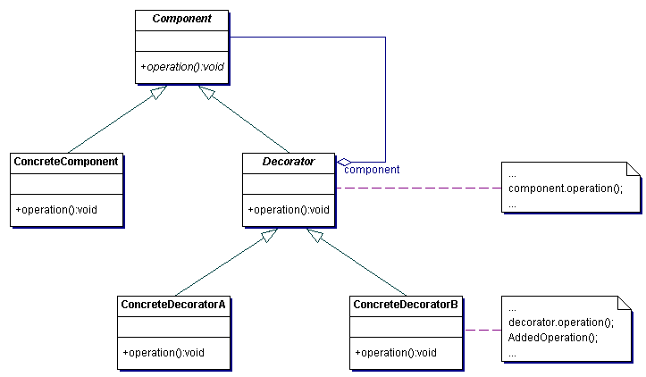

# Decorator

The Decorator pattern provides a flexible alternative to subclassing for extending functionality by adding responsabilities dynamically.

## Example

Imagine we need to create a user authorization system. We know that each user can be granted specific roles that would then enable them to perform certain behaviors based on those roles. Initially we decide there are only two roles - admin and readonly. Admins have the ability to do anything in the system, but read-only users can only view items, but not change them in anyway. One idea we have would be to simply create an Admin user class that has the specific functionality we need and a readonly user that has the abilities we need. Now we know that Admin has all the abilities of read only so we decide to start with a base User class that contains the absolute bare minimum abilities (in our case the read only). We decide to subclass the User class and create an Admin class that extends the base class with new advanced fuctionality.

This works well until we start adding new roles. What if down the road we need 10,20, or 100 roles each with a different set of abilities? This is where the Decorator pattern fills in nicely. It allows us to structure a code organization to make adding new behaviors to an object (not I said object and not class) dynamically. In statically typed languages like C# this gives you some of the power of a dynamic language but also sets a structure that can be easily understood. In JavaScript or Ruby you could simply override prototype or overwrite a specific method directly but the Decorator pattern provides a structure that cna be more easily understood and extended. 

## Participants 

There are 4 participants in this pattern:

+ Component - defines an interface for objects that can have responsibilities added to them
+ ConcreteComponent - defines an object to which additional responsibilities can be added
+ Decorator - maintains a reference to the component and defines and interface that conforms to the Component's interface
+ ConcreteDecorator - adds responsibilities to the component

## Why should I use it?

+ Improves maintainability through the flexibility of the system, i.e. since you can add new behaviors to an object without breaking existing functionality (i.e. [Open/Closed Principle](http://www.objectmentor.com/resources/articles/ocp.pdf))
+ Keeps a very simple, testable base class instead of creating an [Interface Bloat](../../anti-patterns/interface-bloat/README.md) situation

## When should I use it?

+ Need to add behavior to objects without affecting other objects of the same class
+ If you need to remove behaviors from an object
+ When subclassing becomes impractical due to large number of classes that would need to be created

## Example Implementation

+ See [decorator-dynamic.rb](decorator-dynamic.rb) for a dynamic language implementation. See a great post on these topics [here](http://robots.thoughtbot.com/post/14825364877/evaluating-alternative-decorator-implementations-in)
+ See [decorator-static.cs](decorator-static.cs) for a statically typed language implementation
