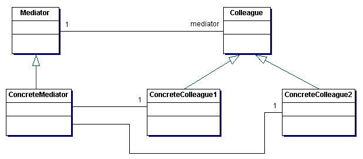

# Mediator

The Mediator pattern defines an object that encapsulates how a set of objects interact. It is a way to promote loose coupling between objects and very their interactions independently. An object has no need to know anything about other object implementations. It is similar to the Observer pattern but rather than a sender and a receiver the Mediator acts as a central hub to manage communication.

## Example

Imagine we are building a GUI where the widgets interact. For instance if you select a particular list item it may update a buttons text. Or it may update another set of lists that in turn affect how a button would get displayed. You can see how this could quickly lead to a lot of complex code and eventually either create a [God Object](../../anti-patterns/god-object/README.md) or a [Big Ball of Mud](../../anti-patterns/big-ball-of-mud/README.md). Instead we can use a Mediator to handle a number of one to many communications instead of creating a number of many to many communications.

## Participants 

There are 3 participants in this pattern:

+ Mediator - defines an interface for communicating with Colleague obects
+ ConcreteMediator - implments cooperative behavior by coordinating Colleagues an maintains Colleagues
+ Colleague - each Colleague knows about its Mediator and communicates with Mediator when it otherwise would have communicated with its Colleague

## Why should I use it?

+ Limits sublcassing by allowing Colleagues to be what they are and remove all communication
+ Promotes decoupling Colleagues by removing direct communication between Colleagues
+ Promotes [Single Responsibility Principle](http://www.objectmentor.com/resources/articles/srp.pdf) by removing the responsibility of interacting with Colleagues from the Colleague object

## When should I use it?

+ A set of objects communicate in complex but well defined ways
+ Reusing objects becomes difficult because it refers to many other objects

## Example Implementation

See [mediator.java](mediator.java)
