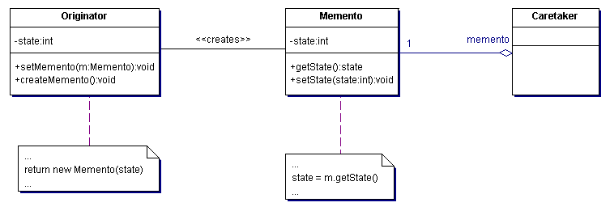

# Memento

The Memento pattern defines a method to externalize an objects internal state without violoating encapsulation and making it available to be restored to this state at a later time.

## Example

Imagine we are tasked with creating an assessment engine where professors can create tests with questions and answers. These assessments are shared across departments to make the burden of creating a good test is shared across multiple people. This is great but some professors have little faith in their peers. They want to make sure they know every change to the assessment, who made the change, and be able to rollback to a previous version if necessary. This is a great opportunity for the Memento pattern. Anytime you hear "rollback" or "versioning" the Memento pattern can be a great tool.  

## Participants 

There are 3 participants in this pattern:

+ Memento - stores as much or as little of the internal state of the originator object as necessary and protects against access by objects other than the originator
+ Originator - creates a memento containing a snapshot of its current internal state and uses the memento to restore its internal state
+ Caretaker - is responsible for the Memento's safekeeping but never examines the contents of the memento

## Why should I use it?

+ Ensures that encapsulation bounds are not unintentionally broken (i.e. preserve the contract/interface thus reducing chance of making breaking changes)
+ Promotes [Single Responsibility Principle](http://www.objectmentor.com/resources/articles/srp.pdf) by removing the responsibility of preserving state from the Originator

## When should I use it?

+ A snapshot or portion of an object's state must be saved so that it can be restored later and a direct interface to obtaining the state would expose implementation details thus breaking encapsulation

## Example Implementation

See [memento.rb](memento.rb)
