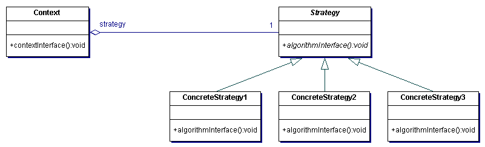

# Strategy

The Strategy pattern provides a framework for interchanging algorithms. A client can use a strategy without knowing the algorithms' implementation details. It is also known as the Policy pattern.

## Example

Imagine we are building a prototype application for a client. The prototype is intended to explore how users interact with an application. We must gather this analytics information and then perform an analysis of the results and present our findings. Our client tells us though a multitude of ways they wish the user to interact with application thus affecting the analytics and in turn our findings. We could simply write a number of different methods or classes that we interchange based on some load criteria. However the Strategy pattern provides a framework to make this much simpler and cleaner.

## Participants 

There are 3 participants in this pattern:

+ Strategy - declares an interface common to all supported algorithms
+ ConcreteStrategy - implements the algorithm that adheres to the Strategy interface
+ Context - is configured to use a ConcreteStrategy but maintains it as a Strategy reference

## Why should I use it?

+ Avoids hardwiring behavior into Context and potentially requiring subclassing Context to support new behaviors
+ Eliminate clunky conditional statements
+ Provides a choice of implementations

## When should I use it?

+ many related classes only differ in their behavior
+ need variants of different algorithms
+ if need to avoid exposing complex algorithm specific data structures
+ a class defines many behaviors and these appear as multiple conditional statements in its operations

## Example Implementation

See [strategy.js](strategy.js)
